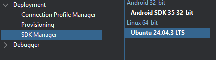
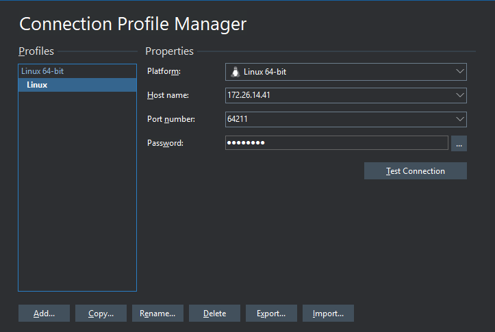

# Embarcadero Conference 2026
## Workshop: Release Management: do artefato ao deploy controlado
### Foco: Empacotamento, versionamento, aprovação, rollback e distribuição
### Facilitador: Armando Corrêa Henrique Neto

> Manual prático para compilar uma aplicação Delphi para Linux,
> empacotar com Docker, publicar no Amazon ECR e preparar a distribuição
> no Amazon ECS.

## Objetivo

Ao final deste workshop, você terá uma esteira de CI/CD:

``` text
Código Delphi → GitHub Actions → Build Linux64 → Artifact → Docker → Amazon ECR → Amazon ECS/Fargate
```

### O que vamos construir

-   Compilação Delphi para Linux64
-   GitHub Actions com Self-Hosted Runner
-   Compartilhamento de artefatos entre jobs
-   Empacotamento com Docker
-   Publicação no Amazon ECR
-   Autenticação GitHub → AWS usando OIDC
-   Versionamento por Git Tag (Semantic Versioning)
-   GitHub Release
-   Base para deploy e rollback no Amazon ECS

> **Modernizar a entrega de uma aplicação Delphi não exige abandonar o
> Delphi.**

------------------------------------------------------------------------

# 1. Requisitos iniciais

## GitHub

-   Conta no GitHub
-   Repositório criado
-   GitHub Actions habilitado

## Windows + Delphi

Para a compilação utilizaremos um Self-Hosted Runner.

A máquina precisa ter:

-   Windows
-   Delphi instalado
-   Plataforma Linux64 configurada
-   SDK Linux configurado
-   GitHub Actions Runner instalado e online

Exemplo:

``` text
DELPHI_PATH=C:\PROGRA~2\EMBARC~1\Studio\37.0
SDK_BASE=C:\SDKs\linux\ubuntu24.04.sdk
```

## AWS

Serviços utilizados:

-   Amazon ECR
-   Amazon ECS
-   IAM
-   CloudWatch Logs

Região sugerida:

``` text
sa-east-1
```

## Checklist

``` text
[ ] Projeto compila manualmente
[ ] Build Linux64 funciona
[ ] Self-Hosted Runner está Online
[ ] Docker está funcionando
[ ] Repositório GitHub está acessível
[ ] AWS CLI está configurada para testes locais
```

> Antes de automatizar, prove que o processo funciona manualmente.

------------------------------------------------------------------------

# 2. Baixar e preparar o projeto

``` bash
git clone https://github.com/armandocorrea/DextExampleWorkshop-Econ26.git
cd DextExampleWorkshop-Econ26
```

Estrutura esperada:

``` text
/
├── .github/
│   └── workflows/ <- Vamos criar
├── DextExampleWorkshop.dproj
└── Dockerfile <- Vamos criar
```

Compile manualmente:

``` text
Configuration: Release
Platform: Linux64
```

------------------------------------------------------------------------

# 3. Configurar GitHub Runner

Rode no seu servidor windows:

https://github.com/armandocorrea/DextExampleWorkshop-ECon26/settings/actions/runners/new

#### Criar pastar e realizar o download do runner
``` text
mkdir actions-runner; cd actions-runner

Invoke-WebRequest -Uri https://github.com/actions/runner/releases/download/v2.336.0/actions-runner-win-x64-2.336.0.zip -OutFile actions-runner-win-x64-2.336.0.zip

Add-Type -AssemblyName System.IO.Compression.FileSystem ; [System.IO.Compression.ZipFile]::ExtractToDirectory("$PWD/actions-runner-win-x64-2.336.0.zip", "$PWD")
```

#### Criar o runner e configurar com seu o repositório
``` text
./config.cmd --url https://github.com/armandocorrea/DextExampleWorkshop-Econ26 --token <TOKEN>

./run.cmd
```

#### Como usar seu runner
``` text
runs-on: self-hosted  
```
------------------------------------------------------------------------

# 4. Dockerfile

Crie:

``` text
Dockerfile
```

Código:

``` text
FROM ubuntu:24.04

ARG APP_VERSION=development
ARG APP_COMMIT=unknown
ARG APP_BUILD_DATE=unknown

ENV APP_VERSION=${APP_VERSION}
ENV APP_COMMIT=${APP_COMMIT}
ENV APP_BUILD_DATE=${APP_BUILD_DATE}

RUN apt-get update && \
    apt-get install -y \
      libcurl4 \
      openssl \
      libxml2 \
      libpq5 \
      libssl3 \
      zlib1g \
      libstdc++6 \
      libgcc-s1 \
      ca-certificates && \
    ln -s /usr/lib/x86_64-linux-gnu/libpq.so.5 /usr/lib/x86_64-linux-gnu/libpq.so && \
    rm -rf /var/lib/apt/lists/* && \
    apt-get clean  

WORKDIR /app

#Somente se quiser testar local
#COPY DextExampleWorkshop /app/DextExampleWorkshop

COPY docker/app/DextExampleWorkshop /app/DextExampleWorkshop

EXPOSE 8080

RUN chmod +x /app/DextExampleWorkshop

ENTRYPOINT ["./DextExampleWorkshop"]
```
------------------------------------------------------------------------

# 5. Criar o Workflow de CI

Crie:

``` text
.github/workflows/ci.yml
```

Arquitetura:

``` text
build-linux
Windows Self-Hosted
        ↓
Build Delphi Linux64
        ↓
Upload Artifact
        ↓
docker-build
Ubuntu Hosted
        ↓
Download Artifact
        ↓
Docker Build
```

## Build Delphi

``` yaml
name: CI

on:
  push:
    branches:
      - master
  pull_request:

jobs:
  build-linux:
    name: Build Delphi Linux64
    runs-on: self-hosted

    env:
      DELPHI_PATH: C:\PROGRA~2\EMBARC~1\Studio\37.0
      SDK_BASE: C:\SDKs\linux\ubuntu24.04.sdk

    steps:
      - name: Checkout
        uses: actions/checkout@v4

      - name: Instalar dependências (Boss)
        shell: powershell
        run: |          
          boss update

          if ($LASTEXITCODE -ne 0) {
            exit $LASTEXITCODE
          }  

      - name: Verificar dependências
        shell: powershell
        run: |
          Write-Host "=== Boss ==="
          boss --version

          Write-Host "=== Diretório ==="
          Get-ChildItem -Force

          Write-Host "=== Dependências ==="
          Get-ChildItem -Recurse -Directory |
            Where-Object { $_.Name -match "Dext|Boss" } |
            Select-Object FullName

      - name: Otimizar Search Paths
        shell: powershell
        run: |
          $project = "DextExampleWorkshop.dproj"

          $foldersToExclude = @(
            'Examples',
            'Tests',
            'Demos',
            'Donations',
            'Samples',
            'Docs',
            'Help',
            'External',
            'Demo',
            'QA',
            'Documentation'
          )

          $allowlist = @(
            'Tests\Common'
          )

          if (-not (Test-Path $project)) {
            Write-Error "Projeto não encontrado: $project"
            exit 1
          }

          $file = (Resolve-Path $project).Path

          Write-Host ""
          Write-Host "============================================================"
          Write-Host "Higienizando Search Paths"
          Write-Host "Projeto: $file"
          Write-Host "============================================================"
          Write-Host ""

          [xml]$xml = Get-Content $file

          $ns = New-Object System.Xml.XmlNamespaceManager($xml.NameTable)

          $ns.AddNamespace(
            "msbuild",
            "http://schemas.microsoft.com/developer/msbuild/2003"
          )

          $modified = $false

          $xml.SelectNodes(
            "//msbuild:DCC_UnitSearchPath",
            $ns
          ) | ForEach-Object {

            if ($_.InnerText) {

              $newPaths = New-Object System.Collections.Generic.List[string]

              $seen = New-Object System.Collections.Generic.HashSet[string](
                [System.StringComparer]::OrdinalIgnoreCase
              )

              foreach (
                $path in $_.InnerText.Split(
                  ';',
                  [System.StringSplitOptions]::RemoveEmptyEntries
                )
              ) {

                $originalPath = $path
                $normalizedPath = $path.Trim().Replace('/', '\').ToLower()

                if ($normalizedPath.EndsWith('\')) {
                  $normalizedPath =
                    $normalizedPath.Substring(
                      0,
                      $normalizedPath.Length - 1
                    )
                }

                # --------------------------------------------------
                # Remove caminhos duplicados
                # --------------------------------------------------
                if ($seen.Contains($normalizedPath)) {
                  Write-Host "  [DUPLICADO] $originalPath"
                  continue
                }

                $skip = $false

                # --------------------------------------------------
                # Remove diretórios desnecessários
                # --------------------------------------------------
                foreach ($excludedFolder in $foldersToExclude) {

                  if (
                    $normalizedPath -like
                    "*$($excludedFolder.ToLower())*"
                  ) {

                    $skip = $true

                    # ------------------------------------------------
                    # Allowlist
                    # ------------------------------------------------
                    foreach ($allowedPath in $allowlist) {

                      if (
                        $normalizedPath -like
                        "*$($allowedPath.ToLower())*"
                      ) {

                        $skip = $false
                        break
                      }
                    }

                    if ($skip) {
                      Write-Host "  [REMOVIDO] $originalPath"
                      break
                    }
                  }
                }

                if (-not $skip) {
                  $null = $newPaths.Add($originalPath)
                  $null = $seen.Add($normalizedPath)
                }
              }

              $newText = $newPaths -join ";"

              if ($newText -ne $_.InnerText) {
                $_.InnerText = $newText
                $modified = $true
              }
            }
          }

          # ========================================================
          # Salvar projeto
          # ========================================================
          if ($modified) {

            $utf8 = New-Object System.Text.UTF8Encoding($false)

            [System.IO.File]::WriteAllText(
              $file,
              $xml.OuterXml.Replace(' xmlns=""', ''),
              $utf8
            )

            Write-Host ""
            Write-Host "Search Paths corrigidos com sucesso."
          }
          else {

            Write-Host ""
            Write-Host "Nenhuma alteração necessária nos Search Paths."
          }

          # ========================================================
          # Diagnóstico
          # ========================================================
          Write-Host ""
          Write-Host "============================================================"
          Write-Host "Search Paths finais"
          Write-Host "============================================================"

          [xml]$check = Get-Content $file

          $totalLength = 0

          $check.SelectNodes(
            "//msbuild:DCC_UnitSearchPath",
            $ns
          ) | ForEach-Object {

            $length = $_.InnerText.Length

            $totalLength += $length

            Write-Host ""
            Write-Host "Tamanho: $length caracteres"
            Write-Host $_.InnerText
          }

          Write-Host ""
          Write-Host "============================================================"
          Write-Host "Tamanho total dos Search Paths: $totalLength caracteres"
          Write-Host "============================================================"            

      - name: Build Delphi Linux64
        shell: powershell
        run: |
          $project = "DextExampleWorkshop.dproj"
          $platform = "Linux64"
          $config = "Release"

          $env:PATH += ";C:\Windows\Microsoft.NET\Framework\v4.0.30319;$env:DELPHI_PATH\bin"
          $env:BDS = "$env:DELPHI_PATH"

          $studioLib = "$env:BDS\lib\Linux64\release"

          $libPaths = @(
            $studioLib,
            "$env:SDK_BASE\usr\lib\gcc\x86_64-linux-gnu\13",
            "$env:SDK_BASE\usr\lib\x86_64-linux-gnu",
            "$env:SDK_BASE\lib\x86_64-linux-gnu",
            "$env:SDK_BASE\lib64"
          ) -join ";"

          $msbuildArgs = @(
            $project,
            "/t:Build",
            "/p:Config=$config",
            "/p:Platform=$platform",
            "/p:DCC_SysLibRoot=$env:SDK_BASE",
            "/p:DCC_AdditionalSwitches=--libpath:`"$libPaths`""
          )

          & msbuild @msbuildArgs

          if ($LASTEXITCODE -ne 0) {
            exit $LASTEXITCODE
          }
```

## Publicar o Artifact

``` yaml
      - name: Upload Linux artifact
        uses: actions/upload-artifact@v4
        with:
          name: application-linux
          path: bin/**
          if-no-files-found: error
```

## Docker em outro Job

``` yaml
  docker-build:
    name: Build Docker Image
    runs-on: ubuntu-latest
    needs: build-linux

    steps:
      - name: Checkout
        uses: actions/checkout@v4

      - name: Download Linux artifact
        uses: actions/download-artifact@v4
        with:
          name: application-linux
          path: ./docker/app

      - name: Show downloaded files
        run: |
          ls -la
          ls -la ./docker/app

      - name: Build Docker image
        run: |
          docker build \
            -t dext-example-workshop:latest \
            -f Dockerfile \
            .
```

### Conceito importante

Jobs diferentes não compartilham arquivos automaticamente. Utilizamos:

``` text
upload-artifact → GitHub Artifact Storage → download-artifact
```

------------------------------------------------------------------------

# 6. Docker

Fluxo:

``` text
Executável Linux → Dockerfile → Docker Image → Container
```

## Build

``` bash
docker build -t dext-example-workshop:latest .
```

## Listar imagens

``` bash
docker images
```

## Executar

``` bash
docker run --rm dext-example-workshop:latest
```

Com variáveis de ambiente:

``` bash
docker run --rm   -e APP_VERSION="v1.0.0"   -e APP_COMMIT="123456" -e APP_BUILD_DATE="2026-09-01"   dext-example-workshop:latest
```

> Nunca coloque credenciais permanentes da AWS dentro da imagem.

------------------------------------------------------------------------

# 7. Amazon ECR

O ECR armazenará nossas imagens.

``` text
Docker Image → Tag → Amazon ECR → Amazon ECS
```

## Criar pelo Console

``` text
Amazon ECR → Repositories → Create repository
```

Exemplo:

``` text
dext-example-workshop
```

## Criar com AWS CLI

``` bash
aws ecr create-repository   --repository-name dext-example-workshop   --region sa-east-1
```

## Login no ECR

``` bash
aws ecr get-login-password --region sa-east-1 | docker login   --username AWS   --password-stdin ACCOUNT_ID.dkr.ecr.sa-east-1.amazonaws.com
```

## Tag

``` bash
docker tag dext-example-workshop:latest   ACCOUNT_ID.dkr.ecr.sa-east-1.amazonaws.com/dext-example-workshop:v1.0.0
```

## Push

``` bash
docker push   ACCOUNT_ID.dkr.ecr.sa-east-1.amazonaws.com/dext-example-workshop:v1.0.0
```

------------------------------------------------------------------------

# 8. GitHub OIDC e IAM

Em vez de salvar Access Keys permanentes no GitHub:

``` text
GitHub Actions
      ↓ OIDC Token
AWS IAM
      ↓ AssumeRoleWithWebIdentity
Temporary Credentials
      ↓
Amazon ECR
```

## Permissões do Workflow

``` yaml
permissions:
  contents: write
  id-token: write
```

## Identity Provider

No IAM:

``` text
Identity Providers → Add Provider → OpenID Connect
```

Provider URL:

``` text
https://token.actions.githubusercontent.com
```

Audience:

``` text
sts.amazonaws.com
```

## Criar uma Role (Trust Policy)

``` text
GitHubActionsDextExampleWorkshopRole 
```

### Trust Policy conceitual

``` json
{
    "Version": "2012-10-17",
    "Statement": [
        {
            "Effect": "Allow",
            "Principal": {
                "Federated": "arn:aws:iam::<ACCOUNT_ID>:oidc-provider/token.actions.githubusercontent.com"
            },
            "Action": "sts:AssumeRoleWithWebIdentity",
            "Condition": {
                "StringEquals": {
                    "token.actions.githubusercontent.com:aud": "sts.amazonaws.com"
                },
                "StringLike": {
                    "token.actions.githubusercontent.com:sub": [
                        "repo:<USER_NAME_GITHUB>@<ID_USER_GITHUB>/dext-example-workshop@<ID_REPOSITORY>:ref:refs/tags/v*",
                        "repo:<USER_NAME_GITHUB>@<ID_USER_GITHUB>/dext-example-workshop@<ID_REPOSITORY>:ref:refs/heads/master"
                    ]
                }
            }
        }
    ]
}
```

Obter as informações do projeto:
``` text
https://github.com/<USER_GITHUB>/DextExampleWorkshop/settings/actions/oidc-configuration
```

### Policies

``` text
GitHubActionsPushECR
```

``` json
{
    "Version": "2012-10-17",
    "Statement": [
        {
            "Sid": "ECRGetAuthorizationToken",
            "Effect": "Allow",
            "Action": [
                "ecr:GetAuthorizationToken"
            ],
            "Resource": "*"
        },
        {
            "Sid": "ECRPushImage",
            "Effect": "Allow",
            "Action": [
                "ecr:BatchCheckLayerAvailability",
                "ecr:CompleteLayerUpload",
                "ecr:InitiateLayerUpload",
                "ecr:PutImage",
                "ecr:UploadLayerPart"
            ],
            "Resource": "arn:aws:ecr:sa-east-1:<ACCOUNT_ID>:repository/dext-example-workshop"
        }
    ]
}
```

``` text
GitHubActionsDeployECS
```

``` json
{
    "Version": "2012-10-17",
    "Statement": [
        {
            "Sid": "ECSDescribeTaskDefinition",
            "Effect": "Allow",
            "Action": [
                "ecs:DescribeTaskDefinition"
            ],
            "Resource": "*"
        },
        {
            "Sid": "ECSRegisterTaskDefinition",
            "Effect": "Allow",
            "Action": [
                "ecs:RegisterTaskDefinition"
            ],
            "Resource": "*"
        },
        {
            "Sid": "ECSListTaskDefinitions",
            "Effect": "Allow",
            "Action": [
                "ecs:ListTaskDefinitions"
            ],
            "Resource": "*"
        },
        {
            "Sid": "ECSDeployService",
            "Effect": "Allow",
            "Action": [
                "ecs:UpdateService",
                "ecs:DescribeServices"
            ],
            "Resource": "arn:aws:ecs:sa-east-1:<ACCOUNT_ID>:service/dext-cluster/task-dext-example-workshop-service"
        },
        {
            "Sid": "IamPassRole",
            "Effect": "Allow",
            "Action": [
                "iam:PassRole"
            ],
            "Resource": "arn:aws:iam::<ACCOUNT_ID>:role/ecsTaskExecutionRole"
        }
    ]
}
```

> Em produção, restrinja a Role ao máximo possível, por exemplo somente
> às tags de release.

------------------------------------------------------------------------

# 9. Amazon ECS

Fluxo:

``` text
Amazon ECS → Task Definition → ECS Service → Fargate Task
```

Checklist:

``` text
[ ] Task Definition criada
[ ] Imagem configurada
[ ] Variáveis de ambiente configuradas
[ ] Cluster criado
[ ] Service criado
[ ] Task Role configurada
[ ] Task Execution Role configurada
```

## Atenção: existem duas Roles

### Task Execution Role

Utilizada pelo ECS para:

-   Baixar imagens do ECR
-   Enviar logs

### Task Role

Utilizada pela aplicação para acessar serviços como:

-   SQS
-   SES
-   S3

> **Task Role ≠ Task Execution Role**

------------------------------------------------------------------------

# 10. Workflow de Release

Crie:

``` text
.github/workflows/release.yml
```

Gatilho:

``` yaml
on:
  push:
    tags:
      - 'v*'
```

Exemplo:

``` text
v1.0.0
v1.0.1
v1.1.0
```

Fluxo:

``` text
Git Tag
   ↓
Build Delphi
   ↓
Artifact
   ↓
Docker Build
   ↓
OIDC
   ↓
Amazon ECR
   ├── v1.0.1
   └── latest
   ↓
GitHub Release
```

## Configurar AWS via OIDC

``` yaml
- name: Configure AWS credentials using OIDC
  uses: aws-actions/configure-aws-credentials@v4
  with:
    role-to-assume: arn:aws:iam::ACCOUNT_ID:role/GitHubActionsApplicationRole
    aws-region: sa-east-1
```

## Validar identidade

``` yaml
- name: Validate AWS identity
  run: aws sts get-caller-identity
```

## Login no ECR

``` yaml
- name: Login to Amazon ECR
  id: login-ecr
  uses: aws-actions/amazon-ecr-login@v2
```

## Publicar imagem

``` yaml
- name: Push Docker image
  run: |
    REGISTRY="${{ steps.login-ecr.outputs.registry }}"
    VERSION="${GITHUB_REF_NAME}"

    docker tag       minha-aplicacao:${VERSION}       ${REGISTRY}/dext-example-workshop:${VERSION}

    docker tag       minha-aplicacao:${VERSION}       ${REGISTRY}/dext-example-workshop:latest

    docker push ${REGISTRY}/dext-example-workshop:${VERSION}
    docker push ${REGISTRY}/dext-example-workshop:latest
```

## Versão completa

``` yaml
name: Release

on:
  push:
    tags:
      - 'v*'

permissions:
  contents: write
  id-token: write

env:
  DELPHI_PATH: 'C:\PROGRA~2\EMBARC~1\Studio\37.0'
  SDK_BASE: 'C:\SDKs\linux\ubuntu24.04.sdk'
  IMAGE_NAME: 'dext-example-workshop'

jobs:
  build:
    name: Build Release
    runs-on: self-hosted

    # Aprovações -> Criar um ambiente e escolher os aprovadores
    #environment:
      #name: production

    steps:
      - name: Checkout
        uses: actions/checkout@v4

      - name: Get version
        id: version
        shell: powershell
        run: |
          $version = "${{ github.ref_name }}"

          Write-Host "Version: $version"

          "version=$version" >> $env:GITHUB_OUTPUT

      - name: Clean output
        shell: powershell
        run: |
          if (Test-Path "bin") {
            Remove-Item "bin" -Recurse -Force
          }

      - name: Instalar dependências (Boss)
        shell: powershell
        run: |          
          boss update

          if ($LASTEXITCODE -ne 0) {
            exit $LASTEXITCODE
          } 

      - name: Verificar dependências
        shell: powershell
        run: |
          Write-Host "=== Boss ==="
          boss --version

          Write-Host "=== Diretório ==="
          Get-ChildItem -Force

          Write-Host "=== Dependências ==="
          Get-ChildItem -Recurse -Directory |
            Where-Object { $_.Name -match "Dext|Boss" } |
            Select-Object FullName

      - name: Otimizar Search Paths
        shell: powershell
        run: |
          $project = "DextExampleWorkshop.dproj"

          $foldersToExclude = @(
            'Examples',
            'Tests',
            'Demos',
            'Donations',
            'Samples',
            'Docs',
            'Help',
            'External',
            'Demo',
            'QA',
            'Documentation'
          )

          $allowlist = @(
            'Tests\Common'
          )

          if (-not (Test-Path $project)) {
            Write-Error "Projeto não encontrado: $project"
            exit 1
          }

          $file = (Resolve-Path $project).Path

          Write-Host ""
          Write-Host "============================================================"
          Write-Host "Higienizando Search Paths"
          Write-Host "Projeto: $file"
          Write-Host "============================================================"
          Write-Host ""

          [xml]$xml = Get-Content $file

          $ns = New-Object System.Xml.XmlNamespaceManager($xml.NameTable)

          $ns.AddNamespace(
            "msbuild",
            "http://schemas.microsoft.com/developer/msbuild/2003"
          )

          $modified = $false

          $xml.SelectNodes(
            "//msbuild:DCC_UnitSearchPath",
            $ns
          ) | ForEach-Object {

            if ($_.InnerText) {

              $newPaths = New-Object System.Collections.Generic.List[string]

              $seen = New-Object System.Collections.Generic.HashSet[string](
                [System.StringComparer]::OrdinalIgnoreCase
              )

              foreach (
                $path in $_.InnerText.Split(
                  ';',
                  [System.StringSplitOptions]::RemoveEmptyEntries
                )
              ) {

                $originalPath = $path
                $normalizedPath = $path.Trim().Replace('/', '\').ToLower()

                if ($normalizedPath.EndsWith('\')) {
                  $normalizedPath =
                    $normalizedPath.Substring(
                      0,
                      $normalizedPath.Length - 1
                    )
                }

                # --------------------------------------------------
                # Remove caminhos duplicados
                # --------------------------------------------------
                if ($seen.Contains($normalizedPath)) {
                  Write-Host "  [DUPLICADO] $originalPath"
                  continue
                }

                $skip = $false

                # --------------------------------------------------
                # Remove diretórios desnecessários
                # --------------------------------------------------
                foreach ($excludedFolder in $foldersToExclude) {

                  if (
                    $normalizedPath -like
                    "*$($excludedFolder.ToLower())*"
                  ) {

                    $skip = $true

                    # ------------------------------------------------
                    # Allowlist
                    # ------------------------------------------------
                    foreach ($allowedPath in $allowlist) {

                      if (
                        $normalizedPath -like
                        "*$($allowedPath.ToLower())*"
                      ) {

                        $skip = $false
                        break
                      }
                    }

                    if ($skip) {
                      Write-Host "  [REMOVIDO] $originalPath"
                      break
                    }
                  }
                }

                if (-not $skip) {
                  $null = $newPaths.Add($originalPath)
                  $null = $seen.Add($normalizedPath)
                }
              }

              $newText = $newPaths -join ";"

              if ($newText -ne $_.InnerText) {
                $_.InnerText = $newText
                $modified = $true
              }
            }
          }

          # ========================================================
          # Salvar projeto
          # ========================================================
          if ($modified) {

            $utf8 = New-Object System.Text.UTF8Encoding($false)

            [System.IO.File]::WriteAllText(
              $file,
              $xml.OuterXml.Replace(' xmlns=""', ''),
              $utf8
            )

            Write-Host ""
            Write-Host "Search Paths corrigidos com sucesso."
          }
          else {

            Write-Host ""
            Write-Host "Nenhuma alteração necessária nos Search Paths."
          }

          # ========================================================
          # Diagnóstico
          # ========================================================
          Write-Host ""
          Write-Host "============================================================"
          Write-Host "Search Paths finais"
          Write-Host "============================================================"

          [xml]$check = Get-Content $file

          $totalLength = 0

          $check.SelectNodes(
            "//msbuild:DCC_UnitSearchPath",
            $ns
          ) | ForEach-Object {

            $length = $_.InnerText.Length

            $totalLength += $length

            Write-Host ""
            Write-Host "Tamanho: $length caracteres"
            Write-Host $_.InnerText
          }

          Write-Host ""
          Write-Host "============================================================"
          Write-Host "Tamanho total dos Search Paths: $totalLength caracteres"
          Write-Host "============================================================"                                

      - name: Build Delphi Linux64
        shell: powershell
        run: |
          $project = "DextExampleWorkshop.dproj"
          $platform = "Linux64"
          $config = "Release"

          $delphiPath = $env:DELPHI_PATH
          $sdkBase = $env:SDK_BASE

          $env:PATH += ";C:\Windows\Microsoft.NET\Framework\v4.0.30319;$delphiPath\bin"

          $env:BDS = $delphiPath

          $STUDIO_LIB = "$env:BDS\lib\Linux64\release"

          $LIB_PATHS = @(
            $STUDIO_LIB,
            "$sdkBase\usr\lib\gcc\x86_64-linux-gnu\13",
            "$sdkBase\usr\lib\x86_64-linux-gnu",
            "$sdkBase\lib\x86_64-linux-gnu",
            "$sdkBase\lib64"
          ) -join ";"

          $MSBuildArgs = @(
            $project,
            "/t:Build",
            "/p:Config=$config",
            "/p:Platform=$platform",
            "/p:DCC_SysLibRoot=$sdkBase",
            "/p:DCC_AdditionalSwitches=--libpath:`"$LIB_PATHS`""
          )

          & msbuild @MSBuildArgs

          if ($LASTEXITCODE -ne 0) {
            exit $LASTEXITCODE
          }

      - name: Validate binary
        shell: powershell
        run: |
          if (-not (Test-Path "bin/DextExampleWorkshop")) {
            Write-Error "Linux binary was not generated."
            exit 1
          }

          Get-Item "bin/DextExampleWorkshop" |
            Format-List Name, Length, LastWriteTime

      - name: Upload binary artifact
        uses: actions/upload-artifact@v4
        with:
          name: DextExampleWorkshop
          path: |
            ./bin/DextExampleWorkshop

  docker-build:
    name: Build Docker Image
    runs-on: ubuntu-latest
    needs: build

    steps:
      - name: Checkout
        uses: actions/checkout@v4

      - name: Download Linux artifact
        uses: actions/download-artifact@v4
        with:
          name: DextExampleWorkshop
          path: ./docker/app

      - name: Show downloaded files
        run: |
          ls -la
          ls -la ./docker/app

      - name: Get build metadata
        id: metadata
        run: |
          echo "version=${GITHUB_REF_NAME}" >> "$GITHUB_OUTPUT"
          echo "commit_sha=${GITHUB_SHA::7}" >> "$GITHUB_OUTPUT"
          echo "build_date=$(date -u +"%Y-%m-%dT%H:%M:%SZ")" >> "$GITHUB_OUTPUT"    

      - name: Build Docker image
        run: |
          docker build \
            --build-arg APP_VERSION=${{ steps.metadata.outputs.version }} \
            --build-arg APP_COMMIT=${{ steps.metadata.outputs.commit_sha }} \
            --build-arg APP_BUILD_DATE=${{ steps.metadata.outputs.build_date }} \
            -t dext-example-workshop:${{ steps.metadata.outputs.version }} \
            -t dext-example-workshop:latest \
            -f Dockerfile \
            .

      - name: Validate Docker image
        run: |
          docker image inspect dext-example-workshop:${{ steps.metadata.outputs.version }}

      - name: Show Docker images
        run: |
          docker images dext-example-workshop

      - name: Save Docker image
        run: |
          docker save \
            dext-example-workshop:${{ steps.metadata.outputs.version }} \
            -o dext-example-workshop-image.tar

      - name: Upload Docker image artifact
        uses: actions/upload-artifact@v4
        with:
          name: dext-example-workshop-docker-image
          path: dext-example-workshop-image.tar
          if-no-files-found: error

  publish-ecr:
    name: Publish Docker Image to ECR
    runs-on: ubuntu-latest
    needs: docker-build

    steps:
      - name: Download Docker image artifact
        uses: actions/download-artifact@v4
        with:
          name: dext-example-workshop-docker-image
          path: .

      - name: Load Docker image
        run: |
          docker load -i dext-example-workshop-image.tar

      - name: Configure AWS credentials using OIDC
        uses: aws-actions/configure-aws-credentials@v4
        with:
          role-to-assume: arn:aws:iam::<ACCOUNT_ID>:role/GitHubActionsDextExampleWorkshopRole
          aws-region: sa-east-1

      - name: Login to Amazon ECR
        id: login-ecr
        uses: aws-actions/amazon-ecr-login@v2

      - name: Get version
        id: version
        run: |
          echo "version=${GITHUB_REF_NAME}" >> $GITHUB_OUTPUT

      - name: Tag Docker image for ECR
        run: |
          docker tag \
            dext-example-workshop:${{ steps.version.outputs.version }} \
            ${{ steps.login-ecr.outputs.registry }}/dext-example-workshop:${{ steps.version.outputs.version }}

          docker tag \
            dext-example-workshop:${{ steps.version.outputs.version }} \
            ${{ steps.login-ecr.outputs.registry }}/dext-example-workshop:latest

      - name: Push Docker image to ECR
        run: |
          docker push \
            ${{ steps.login-ecr.outputs.registry }}/dext-example-workshop:${{ steps.version.outputs.version }}

          docker push \
            ${{ steps.login-ecr.outputs.registry }}/dext-example-workshop:latest

  deploy:
    name: Deploy to ECS
    needs: publish-ecr

    runs-on: ubuntu-latest

    steps:
      - name: Configure AWS credentials using OIDC
        uses: aws-actions/configure-aws-credentials@v4
        with:
          role-to-assume: arn:aws:iam::<ACCOUNT_ID>:role/GitHubActionsDextExampleWorkshopRole
          aws-region: sa-east-1

      - name: Get version
        id: version
        run: |
          echo "version=${GITHUB_REF_NAME}" >> "$GITHUB_OUTPUT"

      - name: Define variables
        id: vars
        run: |
          echo "cluster=dext-cluster" >> "$GITHUB_OUTPUT"
          echo "service=task-dext-example-workshop-service" >> "$GITHUB_OUTPUT"
          echo "task-definition=task-dext-example-workshop" >> "$GITHUB_OUTPUT"

          echo "image=<ACCOUNT_ID>.dkr.ecr.sa-east-1.amazonaws.com/dext-example-workshop:${GITHUB_REF_NAME}" >> "$GITHUB_OUTPUT"

      - name: Download current Task Definition
        run: |
          aws ecs describe-task-definition \
            --task-definition "${{ steps.vars.outputs.task-definition }}" \
            --query taskDefinition \
            --output json > task-definition.json

      - name: Update container image
        run: |
          jq \
            --arg IMAGE "${{ steps.vars.outputs.image }}" \
            '.containerDefinitions[0].image = $IMAGE |
             del(
               .taskDefinitionArn,
               .revision,
               .status,
               .requiresAttributes,
               .compatibilities,
               .registeredAt,
               .registeredBy
             )' \
            task-definition.json > task-definition-new.json

      - name: Register new Task Definition
        id: task-definition
        run: |
          REVISION=$(aws ecs register-task-definition \
            --cli-input-json file://task-definition-new.json \
            --query 'taskDefinition.revision' \
            --output text)

          echo "revision=${REVISION}" >> "$GITHUB_OUTPUT"

          echo "======================================"
          echo "Task Definition: task-dext-example-workshop:${REVISION}"
          echo "======================================"

      - name: Update ECS Service
        run: |
          aws ecs update-service \
            --cluster "${{ steps.vars.outputs.cluster }}" \
            --service "${{ steps.vars.outputs.service }}" \
            --task-definition "task-dext-example-workshop:${{ steps.task-definition.outputs.revision }}"

      - name: Wait for ECS service to stabilize
        run: |
          aws ecs wait services-stable \
            --cluster "${{ steps.vars.outputs.cluster }}" \
            --services "${{ steps.vars.outputs.service }}"

      - name: Deployment completed
        run: |
          echo "======================================"
          echo "🚀 DEPLOYMENT CONCLUÍDO"
          echo "======================================"
          echo "Cluster: dext-example-workshop"
          echo "Service: task-dext-example-workshop-service"
          echo "Task Definition: task-dext-example-workshop:${{ steps.task-definition.outputs.revision }}"
          echo "Image: ${{ steps.vars.outputs.image }}"
          echo "======================================"            

  github-release:
    name: Create GitHub Release
    runs-on: ubuntu-latest
    needs:
      - build
      - docker-build
      - publish-ecr
      - deploy

    steps:
      - name: Checkout
        uses: actions/checkout@v4

      - name: Create GitHub Release
        uses: softprops/action-gh-release@v2
        with:
          generate_release_notes: true            
```

------------------------------------------------------------------------

# 11. Deploy e Rollback

## Versionamento

Evite usar somente:

``` text
latest
```

Prefira:

``` text
v1.0.0
v1.0.1
v1.1.0
```

Fluxo:

``` text
Git Tag v1.0.1
       ↓
ECR Image v1.0.1
       ↓
Task Definition
       ↓
ECS Deploy
```

## Rollback

``` text
Deploy v1.0.2
      ↓
Problema?
      ↓
Voltar para v1.0.1
```

Imagens versionadas permitem retornar rapidamente para uma versão
conhecida.

### Versão completa

Crie:

``` text
.github/workflows/rollback.yml
```

``` yaml
name: Rollback

on:
  workflow_dispatch:

permissions:
  contents: read
  id-token: write

env:
  AWS_REGION: sa-east-1
  ECS_CLUSTER: dext-cluster
  ECS_SERVICE: task-dext-example-workshop-service
  ECS_TASK_DEFINITION: task-dext-example-workshop
  ECR_REPOSITORY: dext-example-workshop

jobs:
  rollback:
    name: Rollback ECS
    runs-on: ubuntu-latest

    # Aprovações -> Criar um ambiente e escolher os aprovadores
    #environment:
      #name: production

    steps:
      - name: Validate branch
        run: |
          if [ "${GITHUB_REF_NAME}" != "master" ]; then
            echo "❌ Rollback só pode ser executado na branch master."
            echo "Branch atual: ${GITHUB_REF_NAME}"
            exit 1
          fi

          echo "✅ Branch validada: master"

      - name: Configure AWS credentials using OIDC
        uses: aws-actions/configure-aws-credentials@v4
        with:
          role-to-assume: arn:aws:iam::<ACCOUNT_ID>:role/GitHubActionsDextExampleWorkshopRole
          aws-region: ${{ env.AWS_REGION }}

      - name: Get current Task Definition
        id: current
        run: |
          set -euo pipefail

          CURRENT_TASK_DEFINITION=$(aws ecs describe-services \
            --cluster "$ECS_CLUSTER" \
            --services "$ECS_SERVICE" \
            --query 'services[0].taskDefinition' \
            --output text)

          CURRENT_REVISION=$(echo "$CURRENT_TASK_DEFINITION" | awk -F: '{print $NF}')

          echo "Task Definition atual:"
          echo "$CURRENT_TASK_DEFINITION"

          echo "Revision atual:"
          echo "$CURRENT_REVISION"

          if ! [[ "$CURRENT_REVISION" =~ ^[0-9]+$ ]]; then
            echo "ERRO: não foi possível identificar a revisão atual."
            exit 1
          fi

          if [ "$CURRENT_REVISION" -le 1 ]; then
            echo "ERRO: não existe uma revisão anterior para rollback."
            exit 1
          fi

          echo "task_definition=$CURRENT_TASK_DEFINITION" >> "$GITHUB_OUTPUT"
          echo "revision=$CURRENT_REVISION" >> "$GITHUB_OUTPUT"

      - name: Get previous Task Definition
        id: previous
        run: |
          set -euo pipefail

          CURRENT_REVISION="${{ steps.current.outputs.revision }}"
          PREVIOUS_REVISION=$((CURRENT_REVISION - 1))

          PREVIOUS_TASK_DEFINITION="$ECS_TASK_DEFINITION:$PREVIOUS_REVISION"

          PREVIOUS_TASK_DEFINITION_ARN=$(aws ecs describe-task-definition \
            --task-definition "$PREVIOUS_TASK_DEFINITION" \
            --query 'taskDefinition.taskDefinitionArn' \
            --output text)

          IMAGE=$(aws ecs describe-task-definition \
            --task-definition "$PREVIOUS_TASK_DEFINITION" \
            --query 'taskDefinition.containerDefinitions[0].image' \
            --output text)

          echo "======================================"
          echo "Rollback"
          echo "======================================"
          echo "Atual:    $ECS_TASK_DEFINITION:$CURRENT_REVISION"
          echo "Anterior: $PREVIOUS_TASK_DEFINITION"
          echo "ARN:      $PREVIOUS_TASK_DEFINITION_ARN"
          echo "Imagem:   $IMAGE"
          echo "======================================"

          echo "task_definition=$PREVIOUS_TASK_DEFINITION" >> "$GITHUB_OUTPUT"
          echo "task_definition_arn=$PREVIOUS_TASK_DEFINITION_ARN" >> "$GITHUB_OUTPUT"
          echo "revision=$PREVIOUS_REVISION" >> "$GITHUB_OUTPUT"
          echo "image=$IMAGE" >> "$GITHUB_OUTPUT"

      - name: Show rollback information
        run: |
          echo "======================================"
          echo "⚠️ ROLLBACK PARA PRODUÇÃO"
          echo "======================================"
          echo "Cluster:             $ECS_CLUSTER"
          echo "Service:             $ECS_SERVICE"
          echo ""
          echo "Task Definition atual:"
          echo "${{ steps.current.outputs.task_definition }}"
          echo ""
          echo "Task Definition destino:"
          echo "${{ steps.previous.outputs.task_definition }}"
          echo ""
          echo "Imagem destino:"
          echo "${{ steps.previous.outputs.image }}"
          echo "======================================"

      - name: Update ECS Service
        run: |
          aws ecs update-service \
            --cluster "$ECS_CLUSTER" \
            --service "$ECS_SERVICE" \
            --task-definition "${{ steps.previous.outputs.task_definition_arn }}"

      - name: Wait for ECS service to stabilize
        run: |
          aws ecs wait services-stable \
            --cluster "$ECS_CLUSTER" \
            --services "$ECS_SERVICE"

      - name: Verify deployed Task Definition
        run: |
          set -euo pipefail

          CURRENT_TASK_DEFINITION=$(aws ecs describe-services \
            --cluster "$ECS_CLUSTER" \
            --services "$ECS_SERVICE" \
            --query 'services[0].taskDefinition' \
            --output text)

          EXPECTED_TASK_DEFINITION="${{ steps.previous.outputs.task_definition_arn }}"

          echo "Task Definition atual:"
          echo "$CURRENT_TASK_DEFINITION"

          echo "Task Definition esperada:"
          echo "$EXPECTED_TASK_DEFINITION"

          if [ "$CURRENT_TASK_DEFINITION" != "$EXPECTED_TASK_DEFINITION" ]; then
            echo "ERRO: o ECS não está utilizando a Task Definition esperada."
            exit 1
          fi

          echo "Task Definition validada com sucesso."

      - name: Rollback completed
        run: |
          echo "======================================"
          echo "✅ ROLLBACK CONCLUÍDO"
          echo "======================================"
          echo "Versão anterior:"
          echo "${{ steps.previous.outputs.image }}"
          echo ""
          echo "Task Definition:"
          echo "${{ steps.previous.outputs.task_definition }}"
          echo "======================================"
```

------------------------------------------------------------------------

# 12. Comandos úteis

## Git

``` bash
git clone URL_DO_REPOSITORIO
git tag v1.0.0
git push origin v1.0.0
git tag
```

## Docker

``` bash
docker build -t dext-example-workshop .
docker images
docker run --rm dext-example-workshop -p 8080:8080
docker ps
docker logs CONTAINER_ID
```

## Linux
``` bash
hostname -I
```

## Amazon ECR

``` bash
aws ecr create-repository   --repository-name dext-example-workshop   --region sa-east-1
```

``` bash
aws ecr describe-images   --repository-name dext-example-workshop   --region sa-east-1
```

## Amazon ECS

``` bash
aws ecs list-clusters
```

``` bash
aws ecs list-services   --cluster CLUSTER_NAME
```

``` bash
aws ecs describe-services   --cluster CLUSTER_NAME   --services SERVICE_NAME
```

``` bash
aws ecs update-service   --cluster CLUSTER_NAME   --service SERVICE_NAME   --force-new-deployment
```

------------------------------------------------------------------------

# Ferramentas necessárias

## Gerenciador Boss (Hashload)

``` text
https://github.com/hashload/boss
```

## WSL2

### Habilitar o WSL 2 no Windows

``` text
https://learn.microsoft.com/pt-br/windows/wsl/install
```

### Instalar o Ubuntu

``` text
https://documentation.ubuntu.com/wsl/latest/howto/install-ubuntu-wsl2/
```

### PAServer no linux

Instalar Atualizações de Pacotes/Libs:

``` text
sudo apt update
sudo apt full-upgrade -y
sudo apt install joe wget p7zip-full curl openssh-server build-essential zlib1g-dev libcurl4-gnutls-dev libncurses6 xorg libgl1-mesa-dev libosmesa6-dev libgtk-3-bin -y
sudo apt install libssl openssl -y
sudo apt install build-essential gcc-multilib g++-multilib libgcc-s1
sudo apt install python3 python3-pip
pip3 install six --break-system-packages
sudo apt autoremove -y
```

Copiar o PAServer:

Copiar o zip do PAServer para o home do Ubuntu. Normalmente encontra-se em: "C:\Program Files (x86)\Embarcadero\Studio<versao_delphi>\PAServer"

Descompactar o PAServer:

``` text
Descompactar arquivo usando o comando: unzip <nome_arquivo>
Executar o PAServer
Acesse a pasta PAServer-<versao> usando o comando cd
Execute o aplicativo ./paserver
Digitar uma senha
Digitar i e p para exibir o IP e a Porta
```

Configurar o SDK Linux no Delphi:

Nas configurações do projeto, habilite a compilação para Linux e informe os dados da conexão obtida no passo anterior. Ex.:





## AWS CLI

Como instalar, passo a passo:

``` text
sudo apt update
sudo apt install unzip -y
```

``` text
curl "https://awscli.amazonaws.com/awscli-exe-linux-x86_64.zip" -o "awscliv2.zip"
```

``` text
unzip awscliv2.zip
```

``` text
sudo ./aws/install
```

``` text
aws --version

```

### aws configure

``` text
aws configure
```

Irá solicitar o preenchimento de algumas informações, como:

``` text
AWS Access Key ID: <ACCESS_KEY_USER_IAM>
AWS Secret Access Key: <SECRET_KEY_USER_IAM>
Region (ex: sa-east-1): <REGION>
```

# Desafio final

Evolua a esteira:

``` text
CI
 ↓
Release
 ↓
ECR
 ↓
Aprovação Manual
 ↓
Deploy ECS
 ↓
Health Check
 ↓
Produção
```

Sugestões:

-   GitHub Environments
-   Aprovação manual
-   Deploy automatizado no ECS
-   Health checks
-   Rollback automático
-   Lifecycle Policy no ECR
-   Scan de vulnerabilidades
-   Notificações de falha

------------------------------------------------------------------------

# Conclusão

Você construiu uma base moderna para entrega de uma aplicação Delphi:

``` text
Delphi
  +
Linux
  +
Docker
  +
GitHub Actions
  +
OIDC
  +
Amazon ECR
  +
Amazon ECS
  =
Pipeline Cloud-Native
```

> **Modernizar não é reescrever.**
>
> É criar caminhos para que aplicações existentes continuem evoluindo
> com as práticas e plataformas atuais.

------------------------------------------------------------------------

**Autor:** Armando Neto\
**Tecnologias:** Delphi 13, Docker, GitHub Actions, Amazon ECR, Amazon
ECS e AWS IAM
